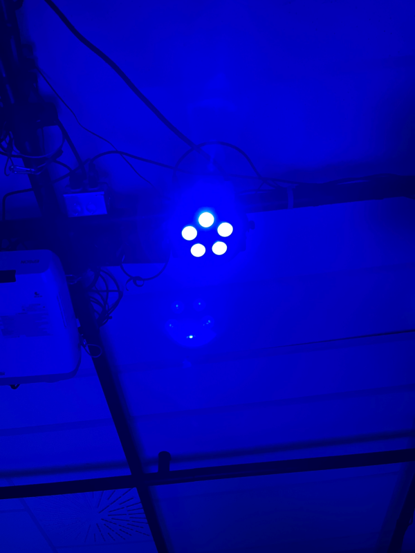

<h1>Présentation de Échomarine de l'exposition Mycélium</h1>
<h2>L'exposition</h2>
L'oeuvre a été exposée au collège Montmorency sur le thème de mycélium, dans le petit studio de techniques d'intégration multimédia. L'oeuvre à été présentée le 23 mars
2023 lors du vernissage et je suis allée la visiter le même jour. L'exposition était temporaire, sur une durée de quatre jours du 20 mars au 23 mars.
  

<h2>L'oeuvre</h2>
L'exposition Echomarine a été créée en 2023 par Florence Lapierre, Natacha Abdallah, Tracy Gua et Maria Laura Coronel.
  « Une projection immersive controlée par un dispositif interactif qui nous donne un aperçu de la beauté des fonds marins tout en mettant de l'avant ses enjeux. Animaux interactifs et plantes marines, Echomarine a un but contemplatif et vise à conscientiser. » (tiré du site internet de TIM Montmorency, Mycelium)
  

Ce type d'installation est principalement contemplatif, mais aussi interactif puisque pour activer les animations il faut cliquer sur les boutons d'une interface web. Le but de cette exposition est de nous sensibiliser aux espèces des fonds marins en voie de disparation, dont la baleine, le requin baleine, le grand requin blanc, le thon rouge, la tortue de mer et le vaquita. Quand on clique sur leur fiche, un texte nous explique les causes de son extinction et les meilleures façon de protéger ces espèces.
  

L'exposition était située dans le petit studio de Techniques d'intégration multimédia du collège montmorency. On y occupe trois de ses murs pour y disposer trois rideaux où sont projetés les animations.
  

L'oeuvre est composée de deux haut-parleurs situé au coin haut droit et au coin haut gauche de la pièce. Trois projecteurs pointent aussi de différentes direction pour projeter les animations sur les rideaux. La tablette est située au centre sur un podium. Une batterie est attachée derrière le podium afin d'alimenter la tablette. Il y a un détecteur de mouvement pour pouvoir faire disparaître le tire lorsqu'un visiteur rentre dans la pièce et activer la lumière en haut du podium. Les fils sont tous accrochés au plafond de la pièce afin de bien les dissimuler.
  

Lorsque le visiteur entre dans la pièce, le titre disparaît et une lumière bleu s'active en haut du podium de la tablette. Le visiteur se dirige ensuite vers la tablette, et six choix d'espèce s'offrent à lui. Il peut cliquer sur chacun d'eux afin d'activer une animation qui est projetée sur les trois rideaux. Son regard passe de sa droite à sa gauche alors que les animations traversent les différents rideaux. Un texte lui est aussi présenté sur la tablette, le sensibilisant aux causes de l'extinction de cette espèce d'animal marin. Personnellement, cette exposition m'a vraiment apaisé. Les sons joués lors des animations étaient doux et m'immersait dans l'univers sous-marin. Les animations étaient plutôt lentes, jolies et presque hypnotiques.
  

<h2>Appréciation personnelle</h2>
Ce qui m'a plu de cette oeuvre c'est son originalité. En effet, il fait usage d'un tout autre équipement que les autres oeuvres de l'exposition: au lieu d'utiliser les ampoules, l'équipe a utilisé les projecteurs. Je trouve l'usage de ceux-ci très biens, car ils nous immerse absolument dans l'univers sous-marin, combiné aux jolis bruits sous-marins.
 Cependant, bien qu'une oeuvre contemplative, je trouve l'interactivité peu intéressante. Cliquer sur le bouton d'une interface web nous détachait de l'aspect immersif très important d'Echomarine. Par ce que j'ai vu des personnes qui visitaient, le texte qui apparaîsait sur l'interface de la tablette était très peu souvent lu, donc le but de sensibiliser les utilisateurs aux extinctions des espèces sous-marines était difficilement atteint.

<h2>Références</h2>
https://tim-montmorency.com/2023/projets/Echomarine/docs/web/index.html
