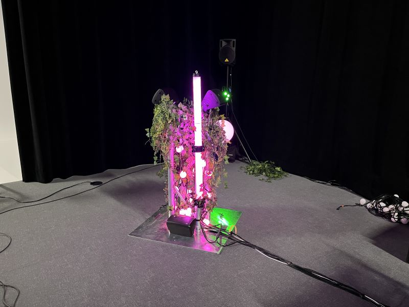
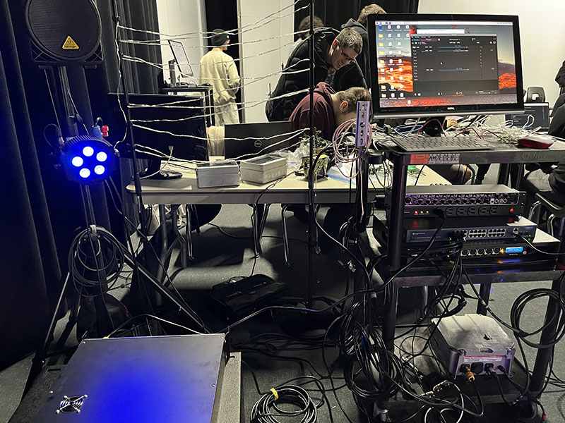
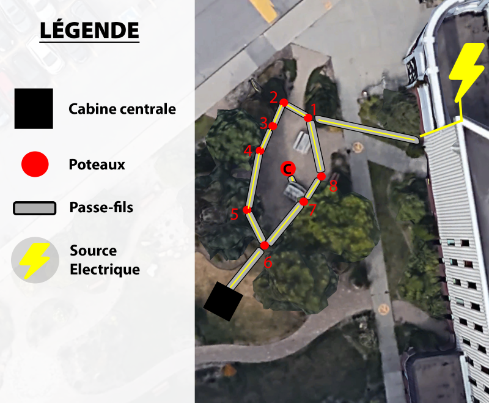
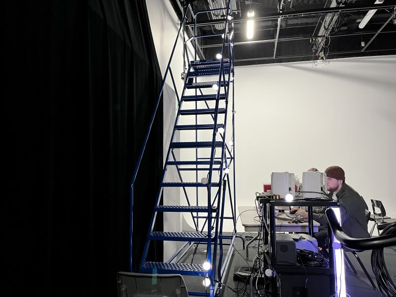
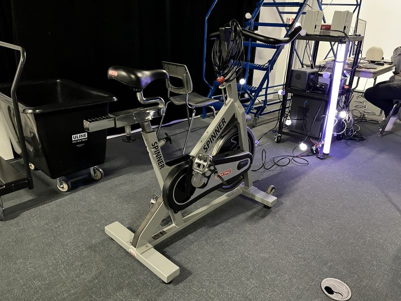
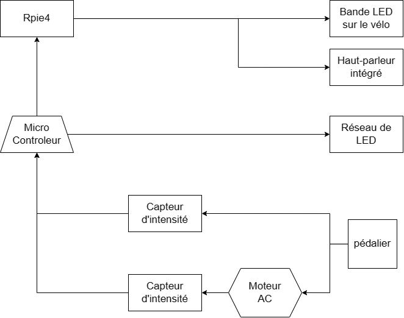
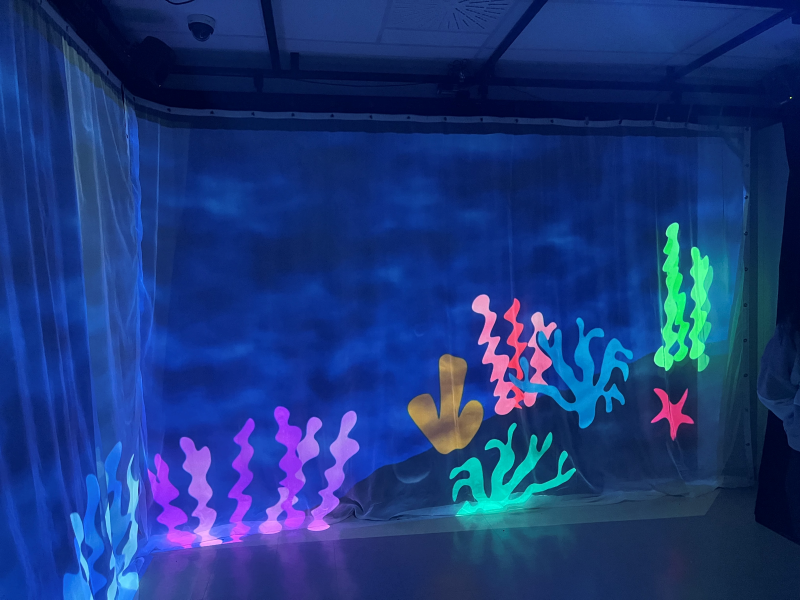
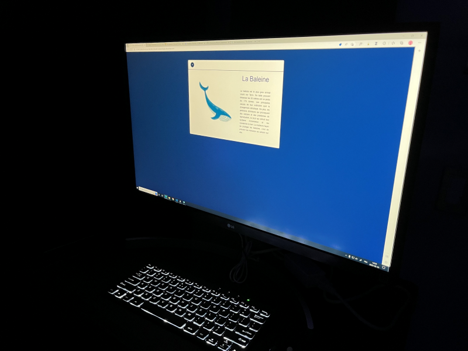
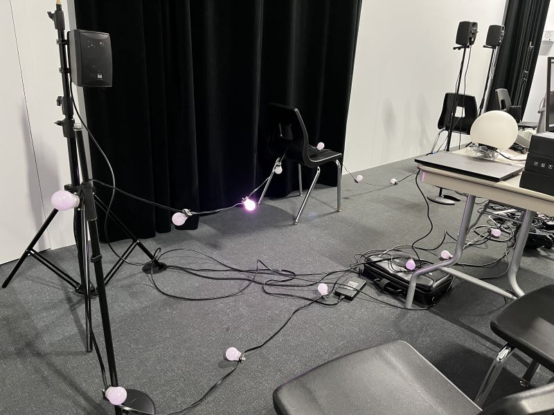
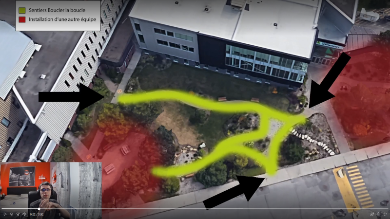

<h1>Exploration des projets en création par les étudiants de 3e année en TIM</h1>
<h1><a href="https://tim-montmorency.com/2023/projets/EDRIA/docs/web/index.html">1 - Edria</a></h1>
<h3>Réalisé par: Elwin Durand, Loic Delorme, Dominic Roberts, Gabriel Leblanc, Meryem Berbiche et Jean-Christophe</h3>

Lors de la visite des studios, c'est le protoype que l'équipe nous a présenté. Ce n'était à peu près que la moitié de la grandeur de l'installation finale, mais les capteurs de mouvements étaient déjà installés. Lorsque trois personnes se tenaient à des côtés opposés de l'installation, les lumières et sons s'harmonisaient pour créer une musique qui nous transportait dans l'ambiance d'une forêt fantastique. Grâce à un capteur de mouvement, une personne faisait activer un son et une lumière, puis deux autres personnes rejoignaient l'expérience pour créer la musique finale.
  

Le schéma de l'installation prévue (https://github.com/F-C-A/EDRIA/blob/main/docs/medias/schema_electrique.png) 
J'ai mis ce projet en première place pour mon projet préféré, car c'est l'installation qui m'a mis le plus dans l'ambiance du thème. Avec les différentes musiques et lumières, on a l'impression de mettre en vie la création. De plus, le concept est vraiment original. Comparé aux autres oeuvres, les visiteurs devront réfléchir pour apprécier la magie de Edria. C'est l'oeuvre dont j'étais la plus excitée à explorer lorsqu'elle sera finie, puisque je crois qu'en l'expérimentant je vais être satisfaite et amusée de l'avoir activée avec mes amis.
<h1><a href="https://tim-montmorency.com/2023/projets/LumaSol/docs/web/index.html">2 - LumaSol</a></h1>
<h3>Réalisé par: Éloïse Gagné, Skayla Stimphil, Michaël Simard et Pénélope Morrisson</h3>

Pour le projet en création, l'équipe a installé un moteur sur un vélo stationnaire. Quand le moteur s'active, des lumières accrochés aux escaliers s'activent progressivement aussi, accompagnées d'une musique atmosphérique. À ce stade-ci, ils prévoyaient acheter un autre vélo stationnaire, puisque celui-ci avait été emprunté de l'école. Le moteur avait quelques problèmes aussi, il ne semblait pas bien s'attacher aux roues et ne marchait que si on le tournait manuellement. Pour le projet final, ils prévoyaient attacher les lumières à un arbre au lieu d'escaliers et, bien sûr, régler ces quelques problèmes. Ces lumières représenteraient les différentes saisons de l'année.
  

Le schéma de l'installation prévue (https://user-images.githubusercontent.com/70410591/215125260-d78220d7-4583-489d-9c77-34b1653faafd.png) 
Ce projet est en deuxième place car j'aime beaucoup l'idée du vélo. Comme Edria, il y a une interaction vraiment intéressante, bien que moins discrète. L'utilisateur se verra probablement émerveillé lorsqu'il tournera les roues du vélo. De plus, j'aime le fait qu'il y a une signification pour chaque lumière et son: les saisons de l'année. En l'expérimentant, je vais essayer de distinguer ce que chacun des sons et lumières représente.
<h1><a href="https://tim-montmorency.com/2023/projets/Echomarine/docs/web/index.html">3 - Echomarine</a></h1>
<h3>Réalisé par: Florence Lapierre, Natacha Abdallah, Tracy Gua et Maria Laura Coronel</h3>

Ce projet nous place dans une pièce de 3 rideaux, sur lesquels sont projectés un univers sous-marin. Grâce à une interface web, on peut jouer une animation de l'un des 6 animals marins proposés. À ce stade-ci, seulement 2 des 6 animations, dont la baleine, sont animées. De plus, ils prévoient remplacer l'ordinateur pour une tablette placée au centre de la pièce sur un support. Il y a deux haut-parleurs, un au coin gauche et un au coin droit, qui nous transporte sous l'eau. À l'activation de l'animation, un bruit de l'animal animé est joué.
  

Le schéma de l'installation prévue (https://github.com/F-C-A/EDRIA/blob/main/docs/medias/schema_electrique.png) 
Ce projet est en troisième position car il part dans une toute autre idée que les autres oeuvres. Au lieu d'utiliser les ampoules, l'équipe a utilisé les projecteurs. Cet usage des projecteurs dans les trois murs de la pièce nous immerse définitivement dans l'univers sous-marin. Cependant, le projet et ses interactivés avec l'utilisateur restent très simple. C'est un peu comme aller dans un site web et cliquer sur des boutons pour activer une animation, sauf que l'écran est projeté sur trois murs. Tout de même, l'immersion est très bien réalisé, avec les bruits sous-marins et la lumière bleutée. Lorsque je vais expérimenter cette oeuvre, je pense passer beaucoup de temps à activer les différentes animations. Même si très simple, c'est divertissant!
<h1><a href="https://tim-montmorency.com/2023/projets/Nexum/docs/web/index.html">4 - Nexum</a></h1>
<h3>Réalisé par: Sébastien Reilly, Sabrina Laforest, Alexandre Daniel et Maxime Des Lauriers</h3>

Au moment de la visite, ce sont des fils de lumière tenus par des chaises que l'équipe avait conçu. Grâce à un capteur de mouvement, le fil activait les lumières une par une pour créer un carrousel de lumière et des hauts-parleurs jouaient des sons qui accompagnait le mouvement des ampoules. Ils avaient aussi conçu un joli code QR qui amenait à la page de leur projet, mais il ne fonctionnait pas encore sur les téléphones apple. Ils ont prévus de fixer ce problème et allonger le fil pour assembler un parcours de lumières magiques.
  

Le schéma de l'installation prévue (https://tim-montmorency.com/2023/projets/Nexum/docs/journaux/medias/prise_1.png) 
Ce projet est en dernière place car je le considère comme celui qui offre l'interactivité la moins intéressante. Ça reste tout de même une installation très jolie, j'ai hâte de passer par le parcours de lumière et admirer cette "danse" d'ampoules. En l'expérimentant, je vais être apaisée par les lumières douces. Je l'ai mis à la dernière position car je ne crois pas que le visiteur se sentira réellement impliqué et immersé. J'ai aimé l'apparence originale et créative du code QR, mais le fait que le visiteur doit sortir son téléphone pour apprécier l'entièreté de l'installation nous détache de l'oeuvre en elle-même.
<h1>Conclusion</h1>
Pour créer ce genre de projet, plusieurs des mes cours de techniques d'intégration multimédia seront nécessaire. Premièrement, il y a celui d'animation 2D, qui nous introduit à l'utilisation d'after effects. Dans plusieurs des projets présentés, les équipes personnalisaient les couleurs de leurs lumières avec ce logiciel. Echomarine a utilisé after effects pour créer les animations et le décors sous-marin. Deuxièmement, le cours de conception sonore est définitivement nécessaire. Toutes les équipes ont utilisé un son dans leurs projets, et pour créer avec perfection l'ambiance de son oeuvre, des compétences en audio sont très utiles. Finalement, il y a évidemment le cours de traitement audiovisuel. Sans les compétences apprises dans ce cours, il serait impossible de réaliser un projet de ce genre. En effet, il enseigne la base de la création d'installations interactives.
 
Dans tous les projets, les équipes ont utilisé le capteur de mouvement. C'est une composante technologique dont j'ignorais le fonctionnement. En multimédia, on utilise souvent ceux qui détecte les sources de chaleur, les capteurs de mouvement infrarouge. Ce dispositif analyse la chaleur produite par un humain ou animal mammifère. La chaleur qui est émanée de ces-derniers produits des infrarouges. Le capteur détecte donc le rayonnement infrarouge et s'active.
