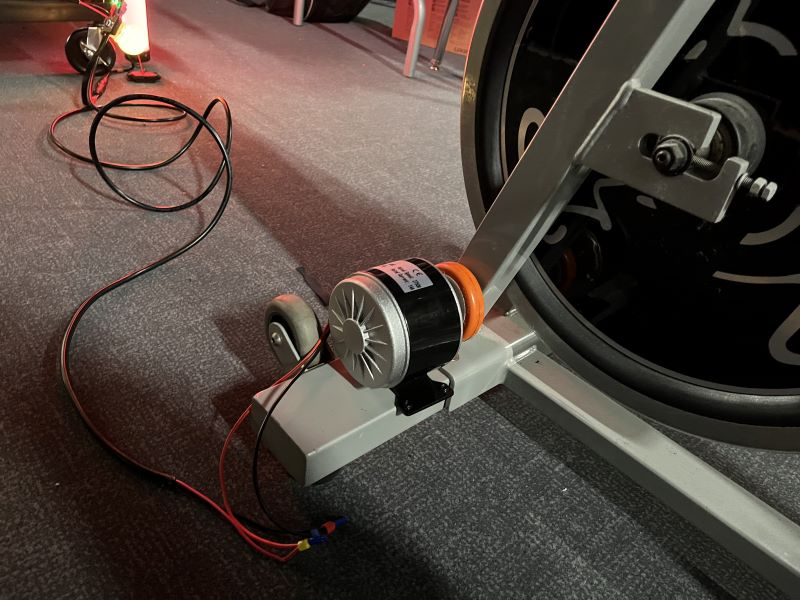
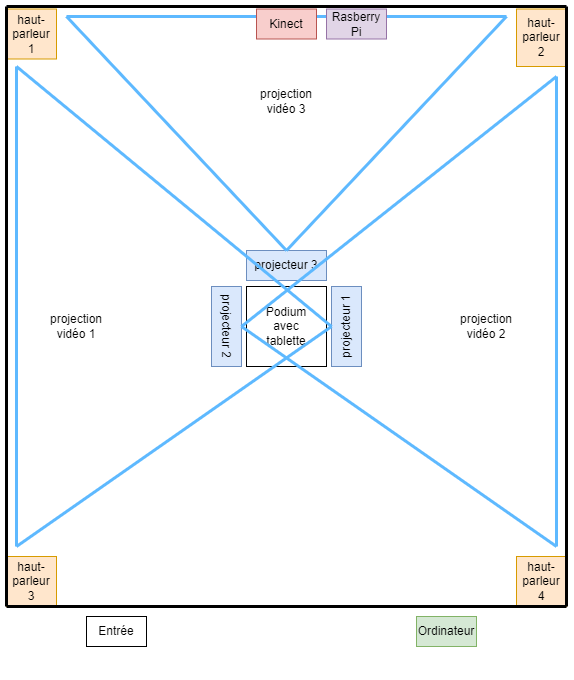

<h1>Exploration des projets en création par les étudiants de 3e année en TIM</h1>
<h1><a href="https://tim-montmorency.com/2023/projets/EDRIA/docs/web/index.html">1 - Edria</a></h1>
<h3>Réalisé par: Elwin Durand, Loic Delorme, Dominic Roberts, Gabriel Leblanc, Meryem Berbiche et Jean-Christophe</h3>

Lors de la visite des studios, c'est le protoype que l'équipe nous a présenté. Ce n'était à peu près que la moitié de la grandeur de l'installation finale, mais les capteurs de mouvements étaient déjà installés. Lorsque trois personnes se tenaient à des côtés opposés de l'installation, les lumières et sons s'harmonisaient pour créer une musique qui nous transportait dans l'ambiance d'une forêt fantastique. Grâce à un capteur de mouvement, une personne faisait activer un son et une lumière, puis deux autres personnes rejoignaient l'expérience pour créer la musique finale.
  

Le schéma de l'installation prévue (https://github.com/F-C-A/EDRIA/blob/main/docs/medias/schema_electrique.png)
<h1><a href="https://tim-montmorency.com/2023/projets/LumaSol/docs/web/index.html">2 - LumaSol</a></h1>
<h3>Réalisé par: Éloïse Gagné, Skayla Stimphil, Michaël Simard et Pénélope Morrisson</h3>

Pour le projet en création, l'équipe a installé un moteur sur un vélo stationnaire. Quand le moteur s'active, des lumières accrochés aux escaliers s'activent progressivement aussi, accompagnées d'une musique atmosphérique. À ce stade-ci, ils prévoyaient acheter un autre vélo stationnaire, puisque celui-ci avait été emprunté de l'école. Le moteur avait quelques problèmes aussi, il ne semblait pas bien s'attacher aux roues et ne marchait que si on le tournait manuellement. Pour le projet final, ils prévoyaient attacher les lumières à un arbre au lieu d'escaliers et, bien sûr, régler ces quelques problèmes. Ces lumières représenteraient les différentes saisons de l'année.
  

Le schéma de l'installation prévue (https://user-images.githubusercontent.com/70410591/215125260-d78220d7-4583-489d-9c77-34b1653faafd.png)
<h1><a href="https://tim-montmorency.com/2023/projets/Echomarine/docs/web/index.html">3 - Echomarine</a></h1>
<h3>Réalisé par: Florence Lapierre, Natacha Abdallah, Tracy Gua et Maria Laura Coronel</h3>

Ce projet nous place dans une pièce de 4 rideaux, sur lesquels sont projectés un univers sous-marin. Grâce à une interface web, on peut jouer une animation de l'un des 6 animals marins proposés. À ce stade-ci, seulement 2 des 6 animations, dont la baleine, sont animées. De plus, ils prévoient remplacer l'ordinateur pour une tablette placée au centre de la pièce sur un support. Il y a deux haut-parleurs, un au coin gauche et un au coin droit, qui nous transporte sous l'eau. À l'activation de l'animation, un bruit de l'animal animé est joué.
  

Le schéma de l'installation prévue (https://github.com/F-C-A/EDRIA/blob/main/docs/medias/schema_electrique.png)
<h1><a href="https://tim-montmorency.com/2023/projets/Nexum/docs/web/index.html">4 - Nexum</a></h1>
<h3>Réalisé par: Sébastien Reilly, Sabrina Laforest, Alexandre Daniel et Maxime Des Lauriers</h3>

Au moment de la visite, ce sont des fils de lumière tenus par des chaises que l'équipe avait conçu. Grâce à un capteur de mouvement, le fil activait les lumières une par une pour créer un carrousel de lumière et des hauts-parleurs jouaient des sons qui accompagnait le mouvement des ampoules. Ils avaient aussi conçu un joli code QR qui amenait à la page de leur projet, mais il ne fonctionnait pas encore sur les téléphones apple. Ils ont prévus de fixer ce problème et allonger le fil pour assembler un parcours de lumières magiques.
  

Le schéma de l'installation prévue (https://tim-montmorency.com/2023/projets/Nexum/docs/journaux/medias/prise_1.png)
