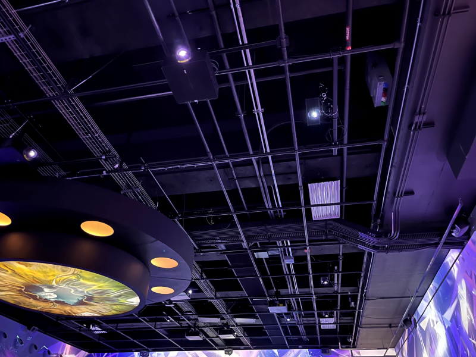
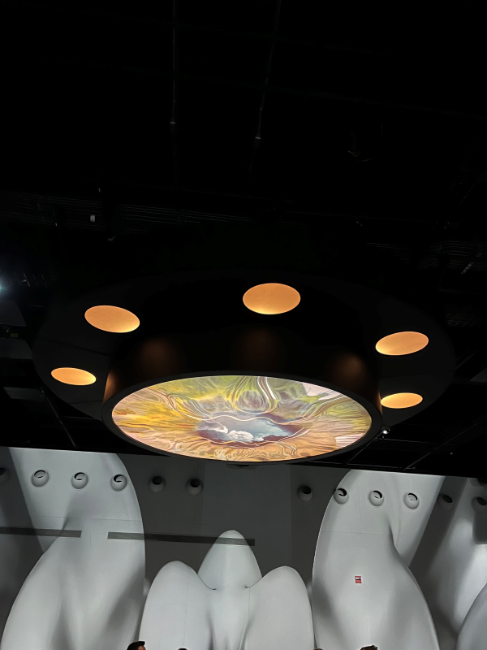

<h1>Présentation de la galerie portail dans Oasis Immersion: Transformé</h1>
<h2>L'exposition</h2>
L'oeuvre a été exposée dans Oasis Immersion au palais des congrès. Ma fiche se porte sur la première galerie, "Portail" et j'y suis allée le 28 février. L'exposition est temporaire, exposée à partir du 19 janvier 2023. La première partie est composée de deux oeuvres immersives, dont "Vestige" et "On The Morning You Wake".
  

<h2>L'oeuvre</h2>

<h3>Vestige</h3>

La première oeuvre immersive, "Vestige" a été créée par Aaron Bradbury avec Atlas V studio et Astrea Immersive.
  « C’est dans le cadre d’un travail de recherche sur le deuil que l’auteur Aaron Bradbury a rencontré Lisa, qui venait de perdre son mari Erik six mois auparavant. Erik était l’amour de sa vie, jusqu’à ce que la mort vienne brutalement les séparer. Au sein d’un vide abyssal, des fragments de souvenirs passés apparaissent, retraçant leur vie commune jusqu’au choc de la mort tragique d’Erik. Conçue grâce aux témoignages recueillis lors d’échanges téléphoniques entre Lisa et Aaron Bradbury, Vestige guide le visiteur dans la traversée du deuil, de la rencontre amoureuse à cette rupture soudaine, dans un univers visuel et narratif à la fois sobre et riche. Ce documentaire émouvant offre une perspective courageuse et lumineuse sur le deuil et l’importance de préserver la mémoire. » (tiré du site internet de Oasis Immersion, Transformé)
  

<h3>On The Morning You Wake</h3>

La deuxième oeuvre immersive, "On The Morning You wake" a créée par Mike Brett, Steve Jamison, Arnaud Colinard et Pierre Zandrowicz avec Atlas V studio et Astrea Immersive.
  « On the Morning You Wake est un documentaire immersif nouveau genre relatant les 38 minutes de terreur vécues par les citoyens hawaïens à la suite d’une alerte leur annonçant qu’un missile nucléaire allait les frapper. À l’aide de faits réels et d’expériences personnelles, le visiteur est propulsé au cœur de cet événement perturbant, témoignant du chaos qui a bouleversé la population. Cet incident amorça une prise de conscience sur la fragilité de la condition humaine et d’écosystèmes qui pourraient être détruits en un claquement de doigts. On the Morning You Wake nous fait réfléchir à notre compréhension de la menace nucléaire, exposant du même coup les traces que cette expérience laissa sur toute une communauté. » (tiré du site internet de Oasis Immersion, Transformé)
  

<h3>Mise en espace et composantes</h3>
Dans les trois galeries combinées, il y a 119 haut-parleurs, 105 projecteurs au laser, 2000 mètres carré de projection et un système d'éclairage LED (tiré du site internet de Oasis Immersion). Avec ces informations, on peut donc conclure que dans la galerie portail il y a près de 30 haut-parleurs et 30 projecteurs au laseur dans une pièce de 500 mètres carré. Il y a aussi une petite projection au centre du plafond. De plus, au plafond, il y a des dizaines de cache-fils qui ont pour but de dissimuler discrètement le branchement des plusieurs projecteurs et haut-parleurs. Dans la pièce, il y aussi plusieurs surfaces où s'assir pour confortablement vivre l'expérience. L'écran de projection est sur les 4 murs, à 360 degrés, pour créer une réalité virtuelle à l'échelle de la pièce. La salle Portail a une capacité de 100 à 250 personnes.
  
Pour l'oeuvre <b>Vestige</b>, la technique utilisée pour la création des personnages en 3D est appelée "Volumetric Livecapture" (tiré du site Atlas V sur l'oeuvre Vestige). Cette technique capture un acteur ou un sujet en 3D pour créer des hologrammes que l'on peut regarder à n'importe quel angle.
  
Pour l'oeuvre <b>On The Morning You wake</b>, tout est réalisé dans un logiciel d'animation 3D (inconnu). Il est possible de visionner cette oeuvre sur un casque Oculus.
  

<h3>Expérience vécue</h3>
La galerie "Portail" est la première de trois salles immersives. Lorsqu'on rentre, il est possible de s'installer sur un banc au centre de la pièce ou à l'un des quatres côtés. Lentement, la première oeuvre "Vestige" commence à apparaître avec la voix de la narratrice. Elle dure 12 minutes, mais c'est assez pour faire couler les larmes à certains. Puis, on transitionne lentement vers la deuxième oeuvre "On The Morning You Wake". C'est une expérience de 15 minutes qui nous font vivre une montagne d'émotions: stress, peur, puis soulagement. En résumé, ces deux oeuvres sont très dramatiques, émouvantes et angoissantes. 
  
<a href="https://youtu.be/6b2MDj53_XI">Extrait de "Vestige"</a> 
<a href="https://www.youtube.com/watch?v=hsbM1whfqFY">Extrait de "On The Morning You Wake"</a>

<h3>Appréciation critique</h3>
J'ai beaucoup aimé la première oeuvre, <b>Vestige</b>. En effet, elle m'a fait subir plusieurs émotions. J'ai été touchée par l'histoire de la narratrice, puisque je ne m'attendrais jamais à ce que quelqu'un que j'aime tombe dans la maladie aussi soudainement. Le deuil est un sujet très difficile à aborder, mais l'auteur l'a évoqué avec perfection. J'ai même pleuré à la fin de l'expérience. Le fait qu'on vive cette histoire dans une salle immersive nous rapproche aussi davantage de la narratrice et ses émotions. Les projections 3D étaient aussi très originales, j'ai aimé l'utilisation de la technique de "Volumetric Livecapture". Ce style nous évoque de la nostalgie, des souvenirs et de notre vulnérabilité, donc cela correspond bien avec l'atmosphère de l'expérience.

 J'ai aussi aimé la deuxième, <b>On The Morning You Wake</b>, aussi très émouvante. Elle nous sensibilise à l'accessiblité facile des armes nucléaires par les plus grandes puissances mondiales. On tombe dans la vie de ces personnes qui pensaient, pour 38 minutes de leur vie, mourir à tout jamais. La sensibilisation est très bien exécutée, je pense que cela à changé la vision de beaucoup de personnes faces aux armes nucléaires, puisqu'on mets en jeu des milliers de familles innocentes. Elle nous démontre aussi que aucun d'entre nous n'est sécuritaire face à la menace nucléaire. J'ai envie de retenir cette idée de recréer des scènes historiques en animation 3D, puis les présenter en réalité virtuelle afin d'immerser les utilisateurs dans les plus importants événements de notre histoire.
 Pour l'aspect technique, il y a par contre des aspects que je ferais autrement. Par exemple, il aurait été intéressant d'intégrer un sol interactif comme le troisième portail, ou bien un plafond complet avec projections. Ça nous aurait immersé d'avantage, puisque les oeuvres se ressentent plutôt comme le visionnement d'un film qu'une expérience en réalité virtuelle à l'échelle de la pièce.

<h2>Références</h2>
https://oasis.im/transforme/
 https://www.quebec.ca/nouvelles/actualites/details/nouvelle-exposition-immersive-doasis-immersion-transforme-un-voyage-immersif-futuriste-et-inspire-de-faits-vecus-45111
 https://congresmtl.com/organisation-evenement/oasis/
 https://atlasv.io/projects/vestige/
 https://astreaimmersive.io/project/on-the-morning-you-wake/
