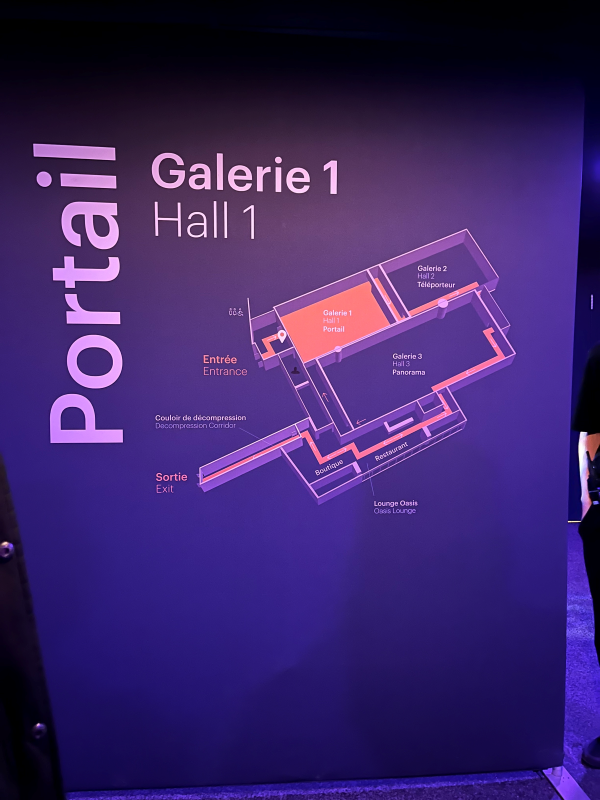

<h1>Présentation de la galerie portail dans Oasis Immersion: Transformé</h1>
<h2>L'exposition</h2>
L'oeuvre a été exposée dans Oasis Immersion au palais des congrès. Ma fiche se porte sur la première galerie, "Portail" et j'y suis allée le 28 février. L'exposition est temporaire, exposée à partir 19 janvier 2023. La première partie est composée de deux oeuvres immersives, dont "Vestige" et "On The Morning You Wake".
  

<h2>L'oeuvre</h2>
<h3>Vestige</h3>
La première oeuvre, "Vestige" a été créée par Aaron Bradbury avec Atlas V studio et Astrea Immersive.
  « C’est dans le cadre d’un travail de recherche sur le deuil que l’auteur Aaron Bradbury a rencontré Lisa, qui venait de perdre son mari Erik six mois auparavant. Erik était l’amour de sa vie, jusqu’à ce que la mort vienne brutalement les séparer. Au sein d’un vide abyssal, des fragments de souvenirs passés apparaissent, retraçant leur vie commune jusqu’au choc de la mort tragique d’Erik. Conçue grâce aux témoignages recueillis lors d’échanges téléphoniques entre Lisa et Aaron Bradbury, Vestige guide le visiteur dans la traversée du deuil, de la rencontre amoureuse à cette rupture soudaine, dans un univers visuel et narratif à la fois sobre et riche. Ce documentaire émouvant offre une perspective courageuse et lumineuse sur le deuil et l’importance de préserver la mémoire. » (tiré du site internet de Oasis Immersion, Transformé)
  

<h3>On The Morning You Wake</h3>
La deuxième oeuvre, "On The Morning You wake" a créée par Mike Brett, Steve Jamison, Arnaud Colinard et Pierre Zandrowicz avec Atlas V studio et Astrea Immersive.
